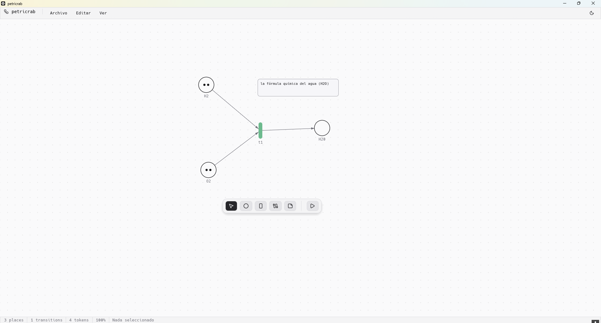
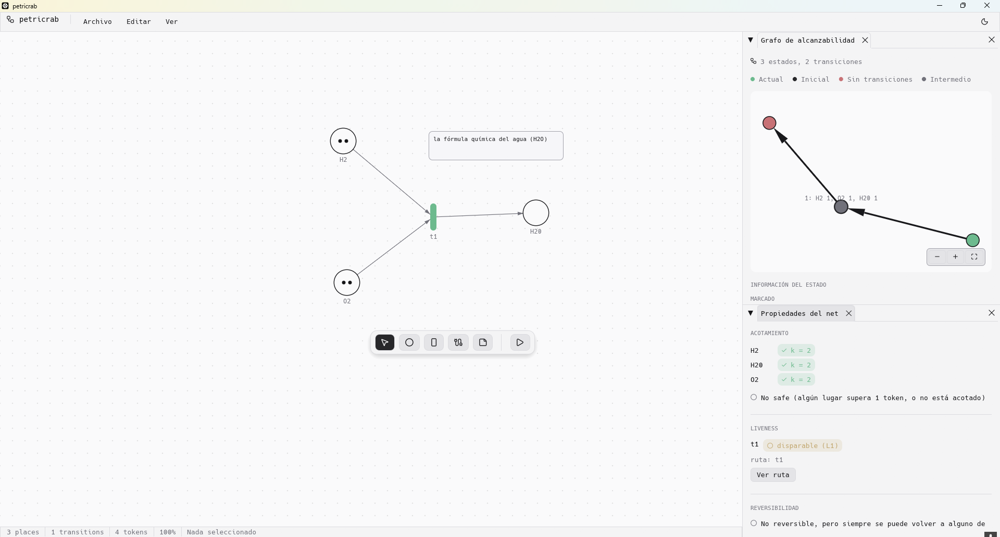
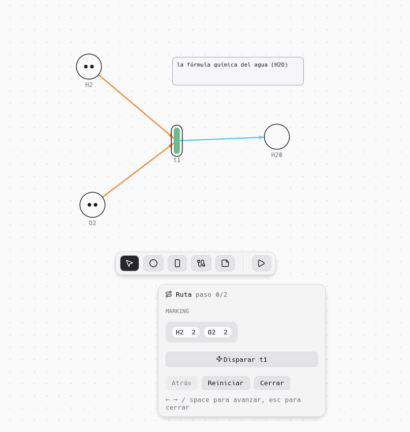
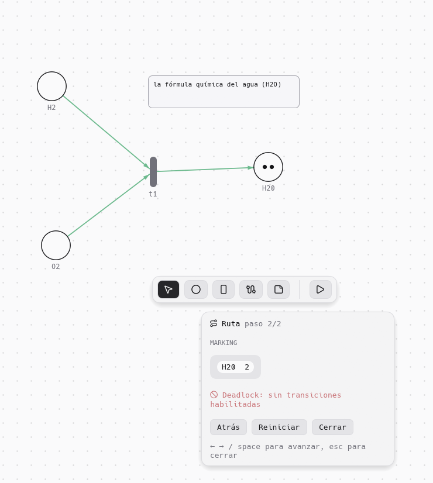
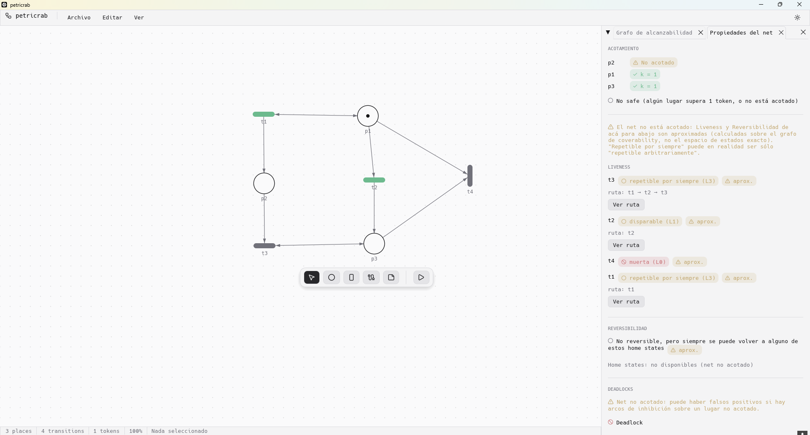
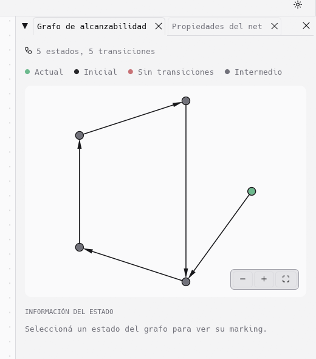

# `🦀 petricrab`

**Librería en Rust para modelar y simular [redes de Petri](https://es.wikipedia.org/wiki/Red_de_Petri)**

## Crates

| Crate | Descripción |
| --- | --- |
| [`petricrab-core`](crates/petricrab-core) | Modelo de red de Petri, simulación y análisis formal: acotamiento/safety, liveness (L0–L4 de Murata), reversibilidad/home states y detección de deadlocks, exacto o sobre el grafo de cobertura de Karp-Miller para redes no acotadas. Ver el [README del crate](crates/petricrab-core/README.md). |
| [`petricrab-app`](crates/petricrab-app) | Editor visual de escritorio con [egui](https://github.com/emilk/egui)/eframe: canvas, simulador, paneles de análisis con reproducción de rutas sobre el canvas real, y proyectos `.gpn`. Ver el [README del crate](crates/petricrab-app/README.md). |

## Estructura

| Ruta | Descripción |
| --- | --- |
| `src/` | Binario principal |
| `crates/petricrab-core/` | Núcleo: modelo, simulación y análisis de redes de Petri |
| `crates/petricrab-app/` | Editor visual (eframe/egui) |

## Editor (`petricrab-app`)

| Área | Qué hace |
| --- | --- |
| Canvas | Pan/zoom, grid, arcos de consumo/peek/inhibit, rotación de transiciones, notas de texto libres con color propio |
| Simulación | Token game paso a paso, deshacer/rehacer, reset al marking inicial |
| Análisis | Grafo de alcanzabilidad interactivo y panel de propiedades (acotamiento, liveness, reversibilidad, deadlocks), en paneles dockeables junto al canvas |
| Ver ruta | Reproduce cualquier secuencia de disparo testigo (deadlock, ejemplo de liveness, camino a un home state, nodo del grafo) directamente sobre el canvas real, con la ruta resaltada y todo lo demás atenuado |
| Proyectos | Guardar/abrir `.gpn` (formato binario propio), lista de recientes persistida |
| Tema | Claro/oscuro, persistido entre sesiones |

Detalle completo en el [README de `petricrab-app`](crates/petricrab-app/README.md).

## Roadmap

| Feature | Estado |
| --- | --- |
| Simulación completa de una red de Petri | ✅ Completo |
| Análisis: acotamiento, liveness, reversibilidad/home states, deadlocks | ✅ Completo |
| Reproducción de rutas sobre el canvas (deadlocks, liveness, reversibilidad, grafo) | ✅ Completo |
| `petricrab-app`, editor visual con [egui](https://github.com/emilk/egui) | 🚧 En progreso (pulido de UI) |
| Arcos peek/inhibit con peso configurable en `petricrab-core` | 📋 Planeado |
| Deadlocks exactos con arcos inhibit sobre lugares no acotados (siphons) | 📋 Planeado |
| Funciones helper de optimización | 📋 Planeado |

## Capturas

_Editor_

_Herramientas del editor_

_Analizando una ruta y viendo su flujo hacia un deadlock_

_Ruta analizada paso a paso sobre el canvas_

_Análisis de una red de Petri que no está acotada_

_Grafo de alcanzabilidad de una red de Petri (acotada)_

## Referencias

- [Paper](http://people.disim.univaq.it/adimarco/teaching/bioinfo15/paper.pdf) en el que se basa `petricrab-core`.
- [Deadlock analysis and control based on Petri nets: A siphon approach review](https://journals.sagepub.com/doi/10.1177/1687814017693542)
- [Deadlock analysis of Petri nets using siphons and mathematical programming](https://ieeexplore.ieee.org/document/650158/)
- [The Minimal Coverability Graph for Petri Nets](https://link.springer.com/chapter/10.1007/3-540-56689-9_45)

## Licencia

Licenciado bajo [MIT](LICENSE).
